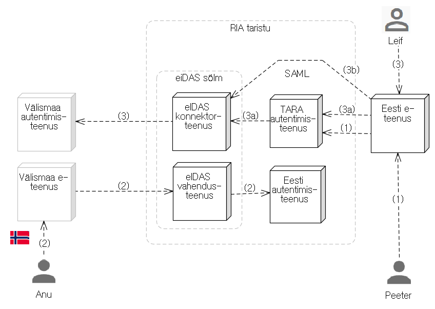

Märkus. Lahtised küsimused on markeeritud sümbolitega //.

# Eesti autentimisteenus. Tehniline kirjeldus
{: .no_toc}

- TOC
{:toc}

## Ülevaade

[https://github.com/ria-eidas/IdP](https://github.com/ria-eidas/IdP)

"Eesti autentimisteenus" on Riigi Infosüsteemi Ameti (RIA) eIDAS sõlme (_Node_) külge ühendatud rakendus, eIDAS-e terminoloogias _identity provider_, mis autendib välisriigist autentimisele suunatud Eesti ID-kaardi või m-ID kasutaja.

Eesti autentimisteenus on osa RIA autentimisteenustest (vt joonis 1).



Joonis 1. RIA autentimisteenused

Vt ka [RIA eIDAS konnektorteenus](https://e-gov.github.io/eIDAS-Connector/) ja [autentimisteenus TARA](https://e-gov.github.io/TARA-Doku/).

## Tarkvara omadused

- liides RIA eIDAS sõlme koosseisus oleva vahendusteenusega (_Proxy Service_)
    - SAML autentimispäringu vastuvõtt ja valideerimine
    - kasutaja autentimine
        - ID-kaardi või
        - m-ID-ga
    - SAML autentimisvastuse koostamine, allkirjastamine ja krüpteerimine ja edastamine eIDAS Node-le
    - SAML metateabe publitseerimine
    - logimine

## Alustarkvara

Rakenduse tarkvaras on aluseks võetud eIDAS Node (v 1.4) tarkvarakomponendid:
- eidas-commons
- eidas-configmodule
- eidas-encryption
- eidas-light-commons
- eidas-parent
- eidas-saml-engine

- m-ID autentimine on teostatud Codeborne teegiga.

## Juhtprogramm

Rakenduse juhtprogramm (ohjur) on klass `IdPMainController` (paketis `ee.ria.IdP`). Juhtprogrammis on meetodid rakenduse poole tehtavate HTTP pöördumiste käsitlemiseks:

- HTTP `GET` päring rakenduse metateabe otspunkti `/metadata`. Vt jaotis "Metateabe väljastamine".
- HTTP `POST` päring `/auth`. Vt jaotis "Autentimise alustamine".
- HTTP `POST` päring `/idauth`. Vt jaotis "ID-kaardiga autentimine".

Samas on ka Eesti autentimisviise teostavad meetodid:

- ID-kaardiga autentimine
  - `readClientCertificate` ja
  - `parseClientCertificate`.

- m-ID-ga autentimine
  - HTTP `POST` päringut `/midwelcome` käsitlev meetod `showMobileIdStart`
  - HTTP `POST` päringut `/midauth` käsitlev meetod `startMobileIdAuth`
  - HTTP `POST` päringut `/midcheck` käsitlev meetod
`showMobileIdCheck`
  - HTTP `GET` päringut `/midstatus` käsitlev meetod
`getMobileIdStatus`.

## Metateabe väljastamine

SAML-metateave on XML-fail, mis väljastatakse vastuseks rakenduse metateabe otspunkti `/metadata` tehtud HTTP `GET` päringule.

Metateabe vastus koostatakse järgmiste klasside ja meetodite abil:
- Paketis `ee.ria.IdP.metadata` on määratletud liides `MetaDataI`, seda teostab klass `MetaDataImpl`, milles on üksainus meetod - `generateMetadata`.
- XML-vormingus vastuse kokkupanemiseks kasutatakse
paketi `eu.eidas.auth.engine.metadata` klassi `EidasMetadata` meetodit `generator` ja klassi `MetadataConfigParams` meetodit `builder`.
- Paketis `ee.ria.IdP.metadata` on ka liides `MetaDataConfigurationI`, milles on meetodid metateabe XML-i koostamiseks vajalike väärtuste sisselugemisest metateabe seadistusest:
    - `getLocalCountry`
    - `getMetaDataUrl`
    - `getPostBindingUrl`
    - `getTechnicalContact`
    - `getSupportContact`
    - `getOrganization`
    - `getSigningMethods`
    - `getDigestMethods`
    - `getEncryptionAlgorithms`.

## Autentimise alustamine

Kasutaja saabub autentimisele HTTP `POST` päringuga otspunkti `/auth`. Päring töödeldakse meetodiga `showWelcome`, mille tähtsaimaks lauseks on meetodi `parseRequest` väljakutse.

Paketis `ee.ria.IdP.eidas` on liides `EidasIdPI`, milles määratletud meetodid
- `parseRequest` - autentimispäringu parsimine ja kontroll
- `buildAuthenticationResponse` - eduka autentimise vastuse koostamine
- `buildErrorResponse` - ebaeduka autentimise vastuse koostamine.

Liidest teostab klass `EidasIdPImpl`.

`parseRequest` tuumtoiming on:

````
authRequest = protocolEngine.unmarshallRequestAndValidate(Base64.decode(samlRequest),
                    metaDataConfiguration.getLocalCountry());

checkRequestAttributes(authRequest);

authRequest = addRequestCallback(authRequest);
````

Sissetulnud päring dekodeeritakse ja valideeritakse. `protocolEngine` on eIDAS-tarkvarast. Meetodiga `checkRequestAttributes` kontrollitakse, kas meie teenus toetab päringus nõutud kohustuslikke atribuute. Kui ei, siis antakse veateade (`InvalidAuthRequest`). // NB! Kahtlus, et siin on atribuutide toe loogikat (mis on üldse segasevõitu) valesti tõlgendatud! //  Meetod `addRequestCallback` võtab kas autentimispäringust või päringu saatja metateabest aadressi, kuhu vastus saadetakse - `AssertionConsumerUrl`.

Kasutajaliides on tehtud JSP abil.

Kasutajale kuvatakse "Welcome" ja pakutakse valida, kas  autenditakse ID-kaardiga või m-ID-ga.

## ID-kaardiga autentimine

Meetodiga `readClientCertificate` loetakse ID-kaardilt sert. Seejärel meetodiga `parseClientCertificate` sert parsitakse  ja loetakse välja vajalikud isikuandmed. Moodustatakse struktuur `EENaturalPerson naturalPerson`, mis on sisendiks meetodile `buildAuthenticationResponse`. Vea korral (kaart mitte lugejas vms) moodustatakse vastus meetodiga `buildErrorResponse`.

## Eduka autentimise vastuse koostamine

Vastus koostatakse meetodis `buildAuthenticationResponse`. Meetodis kasutatakse eIDAS-tarkvara. Meetod ise on suhteliselt lühike.

Praegu tagastakse neli kohustuslikku atribuuti (isikukood, ees- ja perekonnanimi, sünniaeg).

## Krüpto

Paketis `ee.ria.IdP.crypto` on klassid:
- `IdPEncryption` - laiendab eIDAS-tarkvara klassi `AbstractSamlEngineEncryption`
- `IdPkeyStore` - mahukas klass
- `IdPSigner` - laiendab eIDAS-tarkvara klassi `AbstractProtocolSigner`, sisuliselt ainult toetatavate algoritmide määramisega.
